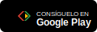
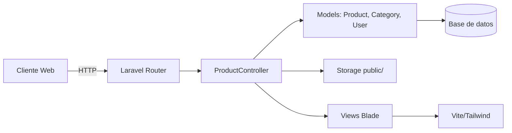
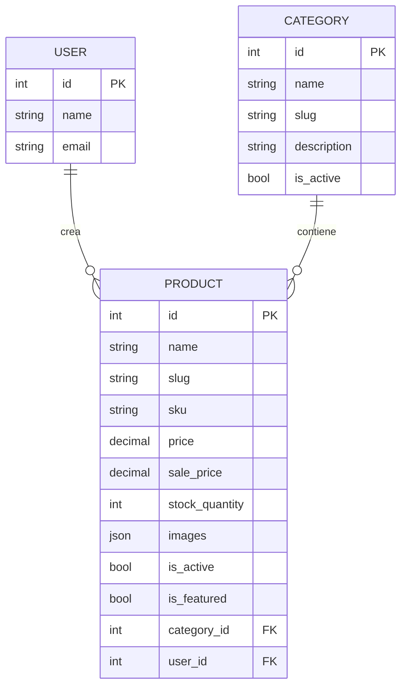

# Seals — Ecommerce B2C (Proyecto estudiantil)

[](https://www.php.net/)
[](https://laravel.com/)
[](https://vitejs.dev/)
[](https://tailwindcss.com/)
[](LICENSE)

Storefront B2C en Laravel con CRUD de productos, categorías, autenticación, vistas públicas y pipeline de assets con Vite/Tailwind.

Pagos y badges disponibles:

    
 

## Tabla de contenido

- Introducción
- Arquitectura
- Estructura del proyecto
- Características
- Rutas principales
- Requisitos
- Instalación (Windows)
- Desarrollo y build
- Testing y calidad
- Variables de entorno
- Notas de imágenes y assets
- Licencia

## Introducción

Seals es un ecommerce B2C educativo. Está construido en Laravel 12 (PHP 8.2) con Vite 7 y Tailwind CSS 4 para el frontend. Incluye autenticación básica, vistas públicas y CRUD completo de productos con categorías e imágenes guardadas en el disco `public`.

## Arquitectura



Relaciones de dominio:



## Estructura del proyecto

```
MercadoLibre2/
├─ app/
│  ├─ Http/Controllers/ProductController.php
│  └─ Models/{Product.php, Category.php, User.php}
├─ config/
├─ database/
│  ├─ migrations/
│  └─ seeders/
├─ public/
│  ├─ index.php
│  ├─ images/
│  └─ storage/            # symlink (storage:link)
├─ resources/
│  ├─ views/
│  │  ├─ layouts/
│  │  ├─ products/{index,create,edit,show}.blade.php
│  │  ├─ home.blade.php, cart.blade.php, categories.blade.php, contact.blade.php
│  │  └─ auth/
│  ├─ css/
│  └─ js/
├─ routes/web.php
├─ composer.json          # PHP 8.2, Laravel 12
├─ package.json           # Vite 7, Tailwind 4
└─ README.md
```

## Características

- Inicio, categorías, contacto y carrito visibles sin autenticación.
- Autenticación: login, registro y logout.
- CRUD de productos con imágenes múltiples (almacenadas en `public/storage`).
- Categorías con semilla automática básica desde el controlador si no existen.
- Vistas Blade con assets gestionados por Vite + Tailwind CSS.

## Rutas principales

- `GET /` → `home`
- `GET /login`, `POST /login`, `GET /register`, `POST /register`, `POST /logout`
- `GET /cart`, `GET /categories`, `GET /contact`
- `Route::resource('products', ProductController::class)` →
  - `GET /products` (index)
  - `GET /products/create` (create)
  - `POST /products` (store)
  - `GET /products/{product}` (show)
  - `GET /products/{product}/edit` (edit)
  - `PUT/PATCH /products/{product}` (update)
  - `DELETE /products/{product}` (destroy)

Sugerencia: proteger rutas de creación/edición con middleware `auth` si el flujo lo requiere.

## Requisitos

- PHP 8.2+
- Composer 2+
- Node.js 18+ y npm
- SQLite/MySQL/PostgreSQL (el proyecto puede funcionar con SQLite por defecto)

## Instalación (Windows)

Configura el entorno local desde PowerShell.

```powershell
# 1) Instalar dependencias PHP
composer install

# 2) Copiar variables de entorno y generar clave
Copy-Item .env.example .env
php artisan key:generate

# 3) Elegir base de datos (opcional)
#   - Para SQLite (rápido):
#     New-Item -ItemType File -Path database/database.sqlite -Force | Out-Null
#     Ajusta DB_CONNECTION=sqlite en .env
#   - O configura MySQL/PostgreSQL en .env

# 4) Migraciones
php artisan migrate

# 5) Enlaces de storage para imágenes públicas
php artisan storage:link

# 6) Instalar dependencias de frontend y levantar Vite
npm install
npm run dev

# 7) Levantar el servidor de Laravel
php artisan serve
```

Atajo opcional (incluye build):

```powershell
composer run setup
```

## Desarrollo y build

- Desarrollo frontend: `npm run dev`
- Build de producción: `npm run build`
- Servidor Laravel: `php artisan serve`

También puedes usar el script de desarrollo concurrente definido en Composer:

```powershell
composer run dev
```

Esto intenta ejecutar en paralelo: servidor, cola, logs interactivos y Vite.

## Testing y calidad

- Tests: `php artisan test`
- Linter/format: `vendor/bin/pint`

```powershell
php artisan test
vendor/bin/pint
```

## Variables de entorno

Revisa `.env` para:

- `APP_NAME`, `APP_URL`
- `DB_CONNECTION` y credenciales
- `FILESYSTEM_DISK=public` para servir imágenes desde `public/storage`

## Notas de imágenes y assets

- Las imágenes de productos se guardan en el disco `public` (ruta visible `public/storage`). Asegúrate de correr `php artisan storage:link`.
- Logos disponibles en `public/images/` (Visa, Mastercard, Mercado Pago) y badges de tiendas.
- Si agregas capturas, colócalas en `public/images/screenshots/` y enlázalas aquí.

## Licencia

MIT. Consulta el archivo `LICENSE` si aplica.
